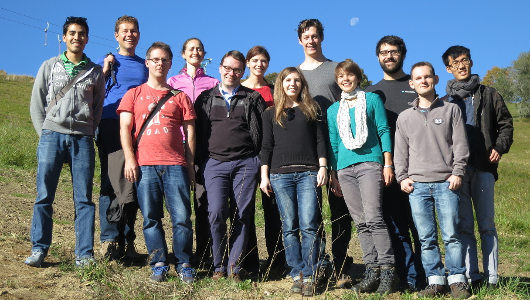

<style scoped>
ul > li:before {
    content: "•";
    color: #1a81c2;
    vertical-align: middle;
    font-family: "Arial Black";
    font-weight: 900;
    margin-left: -.85em;
}
</style>


```{r echo=FALSE}
library(shinyURL)
```

## Sharing a particular view state of an app

<table width="95%" style="border-spacing: 50px; border-collapse: separate; margin: -50px auto;">
<tr>
<td>
### Problem
No build-in mechanism for saving and restoring the state of user inputs in Shiny
</td>
<td></td>
</tr><tr>
<td>
### Solution
Encode widget values in the app's URL
</td>
<td></td>
</tr>
</table>


## shinyURL R package

- resume from a previous view state
- lightweight and easy to use
- share your findings

<div style="position: absolute; bottom: 100px; right: 100px;"> </div>

### Features

- supports all Shiny widgets, including
    - tabsets, navbars
    - dynamic UIs generated using `renderUI()`
- TinyURL query button
- copy-to-clipboard button

<br/>

[github.com/aoles/shinyURL](https://github.com/aoles/shinyURL)


## shinyURL -- demo

```{r, echo=FALSE}
  shinyApp(
    ui = fluidPage(
      titlePanel("Old Faithful Geyser Data"),
      sidebarLayout(
        sidebarPanel(
          selectInput("var", "Variable:", list(`Eruption time` = "eruptions", `Waiting time` = "waiting")),
          sliderInput("bins", "Number of bins:", min = 1,  max = 50, value = 30),
          shinyURL.ui()
        ),
        mainPanel(
          tabsetPanel(id = "tab", 
          tabPanel("Plot", plotOutput("plot")), 
          tabPanel("Summary", verbatimTextOutput("summary"))
        )
        )
      )
    ),
    server = function(input, output, session) {
      shinyURL.server(session)
      data <- reactive(faithful[, input$var])
      output$plot <- renderPlot({
        x <- data()
        bins <- seq(min(x), max(x), length.out = input$bins + 1)
        hist(x, breaks = bins, col = 'darkgray', border = 'white')
      })
      output$summary <- renderPrint(summary(data()))
    }
  )
```


## shinyURL -- use

<span class="blue">1.</span> Load the package in both **server.R** and **ui.R**

        library("shinyURL")

<span class="blue">2.</span> **server.R**: add to the server function a call to
    
        shinyURL.server(session)

<span class="blue">3.</span> **ui.R**: add the shinyURL widget

        shinyURL.ui()

<br/>

<div style="color: gray;"><font style="font-style: italic;">"I was expecting it to take all afternoon to get something functional for passing URLs around but with shinyURL it took 15 minutes. Many thanks for sharing a nice tool!"</font><div style="text-align: right; font-size: 80%;">Edward Wallace, The University of Chicago</div></div>


## shinyURL -- limitations

### URL length

- avoid long names, use short IDs
- use named lists for the argument `choices` in `radioButtons()` and `checkboxGroupInput()`

### Action buttons

Operations performed using action buttons cannot be reliably recorded and restored


## Acknowledgments

<div class="centered">
<table width="100%" style="margin-top: -10px;"><tr>
<td width="25%"><span style="font-size: 120%">Huber Group<span></td>
<td><div style="text-align: center;">

</div></td>
<td width="25%"><div style="text-align: center;">

</div></td>
<td width="25%"><div style="text-align: center;">

</div></td>
</tr>
</table>
<br/>

</div>
